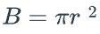
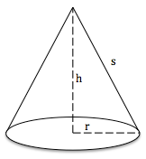
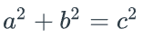
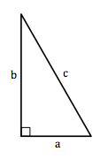
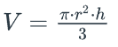

# Assignment 5 - Mathematical methods

## Note: The text below may change slightly until the start of module 5 based on feedback

## Most typical mistakes that students make are:
* they do not read the instructions carefully. Please see how you will be graded section
* they do not use constants
* they do not read the coding rules
* they do the assignment without reading about the theory
* they have not seen the assignment five overview video on Canvas (it will be posted at the start of module 4, the week that follows the assignment four deadline)

## Learning outcomes
The student must show ability and skill in creating and using methods in their program logic to encapsulate code in reusable sections to create more extensive programs.

## Prerequisites
The assignment requires you to study the material in module 5 and bring your knowledge and feedback from previous assignments.

## Task
This task involves you creating several methods that perform various mathematical tasks and calling these from the main method.

Begin the task by constructing a flow chart and program logic on paper. Then describe your structure in text form (pseudocode) in the comment header of the program so that an outsider can understand what the program does and how your logic/algorithm works.

## Methods to implement
The following methods must be implemented

### Area of the circle
You must create a method `area(int radius)` that takes in the radius (positive number) and calculate the base area, in other words, the area of the circle.

The area is returned from the method as a floating point number.

The base area is calculated as 

**Hint:** To calculate the power (e.g., radius r raised to exponent 2), use the library java method `Math.pow(double a, double b)` where a is the radius and b is the exponent.

## Lateral surface area the cone
A cone is a geometric figure with a base surface and a cone surface formed into a tip from the base surface. If the base surface has the shape of a circle and the tip of the cone is directly above or below the center of the circle, then we call the cone a straight, circular cone.



You must create a method `area(int radius, int height)` that takes in the radius and height and calculates the area of the cone surface.

The area is returned from the method as a floating point number.

The area of the cone surface is calculated as 


(how to obtain ```s``` is described in the next section)

Note that you will have two methods called `area.` Having two (or more) methods with the same name is called overloading, and it is the number and type of input parameters that determine which of the methods is run. It is a requirement to have overloaded functions. 

### Pythagoras' theorem
To calculate the area of the surface of the cone, we must first obtain `s` (i.e., the hypotenuse), and for that, we use Pythagoras' theorem:





You should create a method `pythagoras(int sideA, int sideB)` that takes in a and b (positive numbers) and returns the hypotenuse c as a floating point number.

To get the square root of a number, use the library java method `Math.sqrt(double a)`.

### Volume
You should create a method `volume(int radius, int height)` that takes in a radius and height (positive numbers) and calculates the volume.

The volume is returned from the method as a floating point number.

Calculation of the cone's volume is determined using the following formula:



### Fractions
You should create a method `fraction(int numerator, int denominator)` that takes in a numerator and a denominator and converts these into an integer part and a fraction, and shortens the fraction part as far as possible. For example, when the numerator is 32, and the denominator is 12, you should get 2 2/3, not 2 8/12.

The result must be returned in an integer array, int\[3], where the integer part is in first place in the array, and the fraction's numerator and denominator are in second and third place in the array. For example, numerator 7 and denominator 3 should give the result 2 1/3, so the method returns an array that contains {2, 1, 3}.

If the denominator entered is 0, the division should not be performed, and the method should instead return null (since division with 0 is not allowed). If the numerator submitted is 0, the method must return {0, 0, 0}

Pseudocode for the fraction (example)
```
if the denominator is 0, return null
if the numerator is 0, return {0, 0, 0}

array[0] = numerator / denominator; // The quotation gives us the integer
array[1] = numerator % denominator; // The remainder gives us the fraction's numerator
array[2] = denominator;

// Reduce array[1] and array[2] Further, for example, when we do 32 / 12, we should get 2 2/3 and not 2 8/12
find gcd
array[1] = array[1]/gcd;
array[2] = array[2]/gcd;
```

### Reducing using gcd
We will reduce the fraction by finding the greatest common divider (GCD) using Euclide's algorithm.

You should create a method `gcd(int a, int b)`, and it must take in two integers.

```
1. Make sure that a > b (change the place if necessary)
2. As long as b is not 0
      2.1 c = a% b
      2.2 a = b
      2.3 b = c
3. Return a
```

### Printing
You should create a `printFraction(int[] parts)` method that takes an integer array and presents it as `integer numerator / denominator.`

If the first place in the array is 0, there is no integer part. If the second place in the array is 0, then there is no fraction part; if the last place in the array is also 0, the printout should be 0.

If the array is null, the text "Error" should be printed.

The table below shows examples of what to print depending on what is in the array:

| Array | Print |
| --- | ----------- |
| {2, 1, 3} | 2 1/3 |
| {0, 2, 5} | 2/5 |
| {3, 0, 7} | 3 |
| {0, 0, 0} | 0 |
| null | "Error" |

### Input
You should create a method `input()` that reads the user's input and returns either a positive integer (which means the user entered a valid value) or a negative integer. You should define the value to be returned when the user enters invalid values or q (for example, the program returns -1 when the user enters q) see the heading Error Checks .

## Testing of methods
The main program, i.e., the main method, must test the methods, i.e., call methods with input parameters that are retrieved from the user's input data.

Your program should repeatedly read a radius and height (in that order) and test the area and volume methods until the user enters 'q.' Then the program should continue, but now it should read in numerator and denominator (in that order) and test the fraction part. This is repeated until the user enters 'q' again when the program should end.

Appropriate prints are made in the program to be able to follow how the program works. Return values from the area and volume methods are printed by the main method, rounded to two decimal places when printing. The fraction of the fraction method is printed via the printFraction method. Note that it is only the result of the fraction part, which is printed via printFraction, i.e., the answer you get back from the method fraction. A printout of the numerator and denominator you enter, and the equal sign that precedes the answer in the example below is thus printed directly in the main.

## Example run
Below you see an example of how the program should work. The example is designed so the program can be quickly and easily tested for correction, so follow it as closely as possible.

```
----------------------------------
# Test of area and volume methods
----------------------------------
> 2 4 3 5 q
r = 2 h = 4
Circle area: 12.57
Cone area: 28.10
Cone Volume: 16.76

r = 3 h = 5
Cicle area: 28.27
Cone area: 54.96
Cone Volume: 47.12

----------------------------------
# Test of the fractional methods
----------------------------------
> 7 3 12 3 9 0 5 7 q
   7/3 = 2 1/3
  12/3 = 4
   9/0 = "Error"
   5/7 = 5/7
```
It should therefore be possible to enter several values before pressing enter (after enter input is sent to the Scanner object). As usual, you use the Scanner methods hasNext... to check the data type and next... to load one value at a time from the input buffer (until the next separator). The remaining values remain in the input buffer and wait for their turn to be read.

So as you know, this only works if you create the Scanner object only once in the program. So it is best to declare the Scanner object in the class body instead of in the method so that the same Scanner object can be used for all inputs.

NOTE! The scanner variable is the only variable that can be declared in the class body.

## Error checks
All inputs in the program are integers, except `q,` which ends the program. The input of anything other than integers or `q` should be ignored. The program should not crash regardless of what the user enters (e.g., if, for example, you happen to enter a letter or a floating point number instead of an integer).

The reading should be repeated if the user does not type a `q.` Entering 'q' should cause the program to skip to the next part (fraction part) (or end if q was entered in the fraction part).

If the user enters a negative number for radius or height, this number should be converted to a positive by taking the absolute amount of the number: `a = Math.abs (a);.`

## How will you be graded / What do you need to take care of
* You will be graded and checked for functional and non-functional requirements
* Functional requirements
  * Integers can be entered and processed until there is a `q' read. This is done twice
    * First, the area of a circle, the area of a cone, and the volume of the cone calculations and printing
    * Second for calculating the fraction and returning the array
  * The program should never crash and never terminate. When an invalid entry is made, the program should skip or wait for the user to enter a new value.
  * Individual method requirements, as described in each method description above, are also followed.
* Non Functional requirements
  * Strictly follow the coding rules

## Submit the solution
Before you turn in the assignment, please check that your code follows the course's requirements for formatting and coding rules (see the "How will you be graded / What do you need to take care of" section above). 

## Plagiarism 
Submissions may be checked for plagiarism, and the student will be reported to the university's Disciplinary Board in case of cheating.

## Correction
If you turn it in on time, the assignment will be corrected in three weeks. Any submission made after the deadline will have delays; we cannot say how long this takes.

**NOTE! If you need help to complete the task, please don't hesitate to ask the primary teacher instead of submitting a half-finished solution.** 

The grading teacher marks how well the code meets the assignment requirements. Any failed submissions must be reworked and resubmitted to achieve an approved level. On replit, the resubmit button is on the top-right. On Canvas, open the assignment page and click on the "New Attempt" button on the top-right to resubmit.  